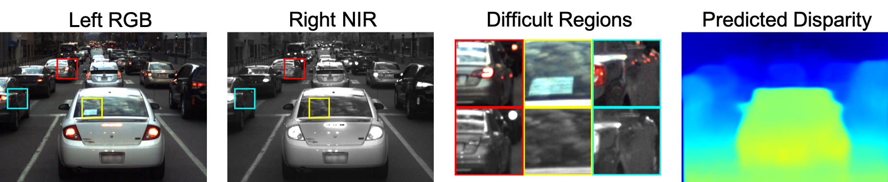

# Deep Material-aware Cross-spectral Stereo Matching

[Tiancheng Zhi](http://cs.cmu.edu/~tzhi), [Bernardo R. Pires](http://www.andrew.cmu.edu/user/bpires/), [Martial Hebert](http://www.cs.cmu.edu/~hebert/), [Srinivasa G. Narasimhan](http://www.cs.cmu.edu/~srinivas/)

IEEE Conference on Computer Vision and Pattern Recognition (CVPR), 2018. 

[[Project](http://www.cs.cmu.edu/~ILIM/projects/AA/RGBNIRStereo/)] [[Paper](http://www.cs.cmu.edu/~ILIM/projects/AA/RGBNIRStereo/files/ZPHN-CVPR18.pdf)] [[Supp](http://www.cs.cmu.edu/~ILIM/projects/AA/RGBNIRStereo/files/ZPHN-CVPR18-supp.pdf)]

<p align="center">

</p>

## Disclaimer
This is an improved and simplified version of the CVPR code. Compared with the original CVPR version, this code achieves a better performance (see pretrained model below). Main changes include:

- No white balancing in STN
- Use normal convolution instead of symmetric convolution in STN
- Randomly flip the input and output of STN
- Use learning rate scheduler
- Hyperparameter changes

To compare with the original CVPR result, please refer to the [project](http://www.cs.cmu.edu/~ILIM/projects/AA/RGBNIRStereo/#dataset) page (first download link to the dataset).

## Requirements
- TITAN Xp GPU * 2
- Ubuntu 16.04
- Python 3
- PyTorch 1.0
- OpenCV
- Visdom (for visualization)

## Data
Download [rgbnir_stereo](https://drive.google.com/file/d/1ikj7UcnQsdxUfDF5EI3YcFK-p63KHQmy/view), and move "data" and "lists" into the "cs-stereo" folder.

Download [precomputed_material](https://drive.google.com/file/d/1CpwHY_xziqkdoa4YXwQbzSGQHZHgvCLM/view?usp=sharing), and put it under the "cs-stereo" folder.

Then run:
```
sh cp_material.sh precomputed_material data
```

See [project](http://www.cs.cmu.edu/~ILIM/projects/AA/RGBNIRStereo/index.html#dataset) page for more information and downlad links of PittsStereo Dataset.

## Training
```
CUDA_VISIBLE_DEVICES=1,0 python3 train.py
```

## Testing
```
CUDA_VISIBLE_DEVICES=1,0 python3 test.py --ckpt-path ckpt/47.pth
```

## Pretrained Model
Download [pretrained.pth](https://drive.google.com/file/d/1i1FQNnH02p1WmrNL5LgZ0ShBYZFBXP_H/view?usp=sharing)

Performance (RMSE, lower is better):

| Model | Common | Light | Glass | Glossy | Vegetation | Skin | Clothing | Bag | Mean |
|:-------|:-----:|:-----:|:-----:|:------:|:----------:|:-----:|:-------:|:---:|:----:|
| CVPR'18 | 0.53 | 0.69 | 0.65 | 0.70 | 0.72 | 1.15 | 1.15 | 0.80 | 0.80 |
| Pretrained |0.47 | 0.56 | 0.56 | 0.61 | 0.72 | 0.93 | 0.91 | 0.86 | 0.70|
